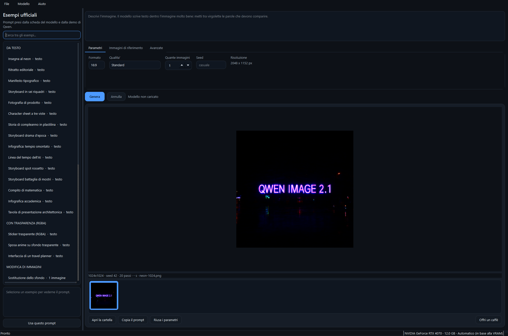
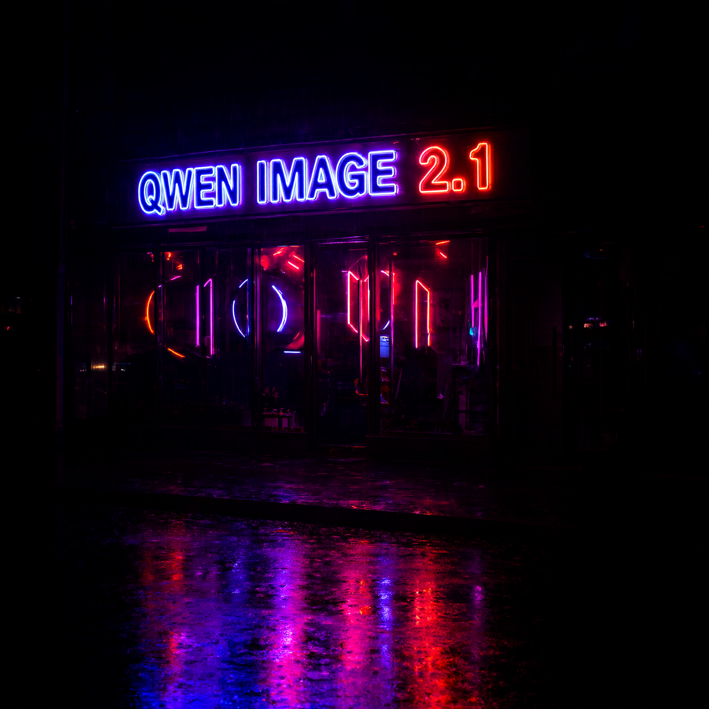

# Image Creator Free

Genera immagini con **[Qwen-Image-2.1](https://huggingface.co/Qwen/Qwen-Image-2.1)** sul tuo
computer: scrivi il prompt, premi Genera, l'immagine resta sul tuo disco. Nessun account,
nessun abbonamento, nessuna immagine che esce da casa tua.

Sito del progetto: **https://imagecreator.bais.info** · [Manuale](docs/MANUALE.md)



Un esempio vero, generato con il prompt ufficiale dell'insegna al neon su una
RTX 4070 da 12 GB: 1024x1024, 20 passi, 2 minuti e 10 secondi.



## Scarica

Windows 10/11 a 64 bit:

- **Installer** (consigliato): [ImageCreatorFree-Setup.exe](https://github.com/bdbais/image-creator-free/releases/latest/download/ImageCreatorFree-Setup.exe)
- **Portatile**: [ImageCreatorFree-portable.exe](https://github.com/bdbais/image-creator-free/releases/latest/download/ImageCreatorFree-portable.exe)

I file non sono firmati: la prima volta Windows SmartScreen mostra un avviso, si passa con
*Ulteriori informazioni → Esegui comunque*. Le impronte SHA-256 di ogni rilascio stanno in
`SHA256SUMS.txt` nella pagina della release.

## Cosa serve

| | |
|---|---|
| Scheda video | NVIDIA da 8 GB di VRAM in su. Il modello occupa 33 GB in bf16, quindi sotto i 20 GB di VRAM resta in RAM e viene spostato sulla GPU un pezzo alla volta: funziona bene, ma è più lento. Senza GPU gira sulla CPU, con tempi nell'ordine delle decine di minuti |
| RAM | 32 GB consigliati; con 16 GB funziona ma il sistema usa molto il file di scambio |
| Disco del modello | **un SSD**: i 33 GB vengono riletti a ogni caricamento. Misurato su questa macchina: 38 secondi da SSD, circa un'ora da disco meccanico |
| Disco | 3 GB per l'ambiente di calcolo e 33 GB per il modello, su un disco a scelta (lo chiede al primo avvio) |
| Rete | solo per i due download iniziali |

Il programma installa da solo PyTorch e diffusers in una cartella separata
(`%LOCALAPPDATA%\ImageCreatorFree\runtime`) e scarica il modello da Hugging Face alla prima
generazione. Se sul computer non c'è Python, ne scarica una copia dedicata: non tocca nulla
di quello che hai già installato.

## Quanto ci mette

Misure su una RTX 4070 da 12 GB con il modello su SSD (offload sequenziale):

| Configurazione | Tempo | Per passo |
|---|---|---|
| Caricamento del modello (da SSD) | 41 s | — |
| 1024x1024, 20 passi | 3 min | 9,1 s |
| 1536x1536, 30 passi (Standard) | 8 min 36 s | 17,2 s |
| 2048x2048, 40 passi (Alta) | VRAM esaurita dopo ~20 min | — |

Con 12 GB di VRAM si arriva comodamente a 1536x1536; per la qualità Alta
servono almeno 16 GB. Il programma avvisa prima di lanciare una risoluzione
che la scheda non regge.

## Cosa fa

- **Testo → immagine** fino a 2048x2048, nei sette formati previsti dal modello (1:1, 4:3,
  3:4, 3:2, 2:3, 16:9, 9:16).
- **Testo dentro l'immagine**: Qwen-Image-2.1 è fatto apposta per insegne, manifesti e
  didascalie. Metti tra virgolette le parole che devono comparire.
- **Immagini trasparenti (RGBA)** native, per sticker e loghi ritagliati.
- **Modifica di immagini**: fino a 10 riferimenti trascinati nella finestra, citabili nel
  prompt come *image 1*, *image 2*...
- **Progetti**: ogni progetto ricorda prompt, parametri, riferimenti e immagini. *Duplica*
  per rigenerare con parametri diversi senza toccare l'originale, oppure crea un progetto
  nuovo da una singola immagine, con il suo seed.
- **Esempi**: i prompt che hai già usato, scene complesse, restauro di foto antiche o
  rovinate (anche con più foto della stessa persona per ricostruire il volto), colorazione
  di foto in bianco e nero e i 40 esempi
  ufficiali della scheda del modello e della demo Hugging Face di Qwen.
- **Si aggiorna da solo**: all'avvio controlla se c'è una versione nuova e mostra le novità.
- **Galleria locale** con seed, passi e parametri salvati dentro il PNG: "Riusa i parametri"
  rimette tutto com'era.
- Tre livelli di qualità e quattro modalità di uso della memoria, per non finire la VRAM.

## Privacy

Nessuna telemetria, nessun account, nessun server. Il programma apre la rete solo per:

- `huggingface.co` - scaricare il modello (e controllarne gli aggiornamenti);
- `pypi.org` / `download.pytorch.org` - installare l'ambiente di calcolo la prima volta;
- `python.org` - solo se manca Python sul sistema.

I prompt, le immagini e lo storico restano in locale: immagini in *Immagini\Image Creator
Free*, impostazioni e storico in `%LOCALAPPDATA%\ImageCreatorFree`.

## Dai sorgenti

```bash
git clone https://github.com/bdbais/image-creator-free
cd image-creator-free
pip install -r requirements.txt
python ImageCreatorFree.pyw
```

Per costruire l'eseguibile servono `requirements-dev.txt` e, per l'installer, Inno Setup 6:

```powershell
.\build.ps1
```

| File | A cosa serve |
|---|---|
| `ImageCreatorFree.pyw` | avvio senza console, punto di ingresso di PyInstaller |
| `src/imagecreator/app.py` | avvio, tema, `--self-test`, `--screenshot` |
| `src/imagecreator/ui/` | finestra principale, prima configurazione, impostazioni |
| `src/imagecreator/core/runtime.py` | crea l'ambiente separato e ci installa torch e diffusers |
| `src/imagecreator/core/worker_client.py` | dialogo con il processo di generazione |
| `worker/qwen_worker.py` | il processo che carica il modello e genera (gira nel runtime) |
| `src/imagecreator/data/presets.json` | i 40 esempi ufficiali di Qwen |
| `site/` | il sito del progetto (Cloudflare Workers) |

L'interfaccia e il motore stanno in due processi distinti: la finestra resta viva anche se
CUDA esaurisce la memoria, e il modello resta caricato tra una generazione e l'altra.

### Pubblicare una versione

1. aggiorna `__version__` in `src/imagecreator/__init__.py`;
2. aggiungi la sezione a `CHANGELOG.md`;
3. `git tag vX.Y.Z && git push origin main --tags`.

La pipeline in `.github/workflows/release.yml` costruisce, testa e pubblica la release.

## Sostieni il progetto

Image Creator Free è gratuito e open source, e lo resterà. Se ti fa risparmiare tempo puoi
offrire un caffè a chi lo mantiene: **[paypal.me/bellizia](https://paypal.me/bellizia)**.
Nessun obbligo, e niente cambia nel programma.

## Contributori

- **Bais** - idea e manutenzione
- **Claude Opus 5** - prima versione dell'applicazione

## Licenza

Il codice di questo programma è distribuito con licenza **MIT** (vedi `LICENSE`).

Il modello **Qwen-Image-2.1** non è incluso e non viene ridistribuito: lo scarica
l'utente da Hugging Face. I suoi pesi sono soggetti alla
[Qwen Research License](https://huggingface.co/Qwen/Qwen-Image-2.1/blob/main/LICENSE), che
ne consente l'uso **per ricerca e valutazione, non per scopi commerciali**. Vedi `NOTICE`.

Built with Qwen.
